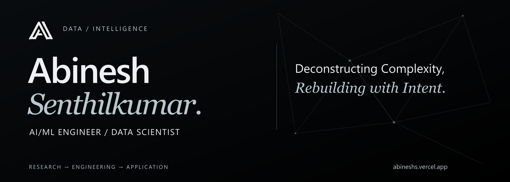
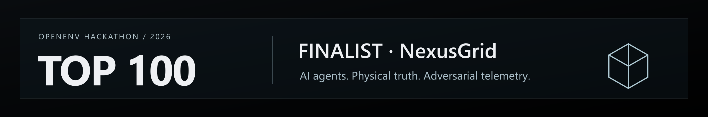

<picture>
  <source media="(max-width: 600px)" srcset="assets/profile-header-mobile.png">
  
</picture>

  
  
  
  

<strong>Bangalore, India</strong> · M.Sc. Data Science at CHRIST (Deemed to be University)

My work connects **machine learning, trustworthy AI, and the systems around them**: how models use evidence, how we evaluate their decisions, and how research becomes a working application.

## Now / the current chapter

**Machine Learning Engineer · Shipd by Datacurve** 
Freelance · Remote · March 2026–Present

Building ML benchmarks across NLP, computer vision, fine-tuning, RAG, Prompt Engineering, Sequence-to-Sequence, From Scratch and model evaluation through Project Eris.

- **Recent engineering work:** nine backend assignments and the **CampaignHub Studio** capstone from my FlyRank AI internship.
- **Academic focus:** pursuing an **M.Sc. in Data Science**, building on a B.Sc. in the same field.
- **Hands-on data engineering:** homework, notes, and experiments from **Data Engineering Zoomcamp 2026**.

## Highlight / built under pressure

**Top 100 finalist · OpenEnv Hackathon 2026** — Meta, PyTorch, and Hugging Face, with Scaler School of Technology.

[**NexusGrid**](https://github.com/AbineshSenthil/NexusGrid-CyberPhysEnv) puts an AI agent inside a simulated power grid where physical faults and spoofed SCADA telemetry can disagree. The task is to distinguish real failures from deceptive observations and choose a recovery action.

`20-node DC power flow` · `Seeded attacks` · `Typed OpenEnv actions` · `Deterministic replay`

[Explore the environment →](https://github.com/AbineshSenthil/NexusGrid-CyberPhysEnv) · [Open the demo →](https://huggingface.co/spaces/Abineshsdata/Nexus-Grid) · [Read the project story →](https://abineshs.vercel.app/blog/nexusgrid/)

## Selected systems / four questions worth building for

<table>
<tr>
<td width="50%" valign="top">
<h3>01 / MIRROR-Rad</h3>

<strong>Does the summary stay faithful to the evidence?</strong>

A clinical NLP text audit that checks both directions: unsupported or contradicted summary claims, and source findings left out of the summary.

<code>PyTorch</code> <code>BioClinicalBERT</code> <code>NLI</code> <code>Calibration</code>

<a href="https://github.com/AbineshSenthil/MIRROR-Rad">Code ↗</a> · <a href="https://mirror-rad.streamlit.app/">Demo ↗</a> · <a href="https://abineshs.vercel.app/blog/mirror-rad/">Story ↗</a>

</td>
<td width="50%" valign="top">
<h3>02 / Quantum Protection Toolkit</h3>

<strong>Which cryptographic system should we protect next, and why?</strong>

An evidence-led workspace for cryptographic inventories, explainable migration priorities, bounded experiments, and signed review bundles.

<code>FastAPI</code> <code>React</code> <code>PostgreSQL</code> <code>Qiskit</code>

<a href="https://github.com/AbineshSenthil/Quantum-Protection-Toolkit">Project showcase ↗</a> · <a href="https://abineshs.vercel.app/blog/qpt/">Story ↗</a>

Collaborative project with Shamatmika R. Public documentation and interface captures; the application runs in a private local environment.

</td>
</tr>
<tr>
<td width="50%" valign="top">
<h3>03 / Aegis-Sphere</h3>

<strong>How much multimodal AI can fit inside a constrained GPU?</strong>

An offline oncology research prototype exploring sequential specialist reasoning, local evidence retrieval, and graceful handling of missing inputs.

<code>MedGemma</code> <code>PyTorch</code> <code>FAISS</code> <code>Streamlit</code>

<a href="https://github.com/AbineshSenthil/Aegis-Sphere">Code ↗</a> · <a href="https://aegis-sphere.streamlit.app/">Demo ↗</a> · <a href="https://abineshs.vercel.app/blog/aegis-sphere/">Story ↗</a>

MedGemma Impact Challenge submission · Collaborative project with Sasipriya K.

</td>
<td width="50%" valign="top">
<h3>04 / CampaignHub Studio</h3>

<strong>How does one article become a reliable multi-platform campaign?</strong>

A FlyRank AI capstone with platform-specific captions and image variants, immediate or scheduled jobs, retry handling, and inspectable publishing history.

<code>TypeScript</code> <code>React</code> <code>Supabase</code> <code>Redis</code> <code>MCP</code>

<a href="https://github.com/AbineshSenthil/flyrank-Ai-Intern/tree/main/capstone-social-studio">Explore capstone ↗</a> · <a href="https://github.com/AbineshSenthil/flyrank-Ai-Intern">Internship work ↗</a>

Public capstone uses simulated platform adapters for its publishing workflow.

</td>
</tr>
</table>

<strong>Open the engineering notes — what connects these systems?</strong>

- **MIRROR-Rad:** reciprocal retrieval separates what a summary adds from what it omits. Evidence, calibration, and review routing make the result inspectable.
- **QPT:** current security urgency and future quantum migration risk are distinct decisions. Controlled experiments and signed bundles support review.
- **NexusGrid:** physical truth and adversarial observations are separate layers. Seeded scenarios make an agent's decisions reproducible.
- **Aegis-Sphere:** specialist passes share a limited GPU budget rather than keeping every model resident at once.
- **CampaignHub Studio:** durable jobs, expiring worker leases, and explicit run history keep the workflow understandable after retries or interruptions.

The common thread: **make the evidence visible, the evaluation reproducible, and the implementation usable.**

## Toolkit / from the dataset to the deployment

| Layer | Tools and approaches |
| --- | --- |
| Models & evaluation | Python · PyTorch · scikit-learn · NLP · computer vision · fine-tuning · NLI · calibration · explainability |
| Retrieval & agents | RAG · FAISS · LLMs · MedGemma · multi-agent workflows · prompt engineering |
| APIs & interfaces | FastAPI · JavaScript / TypeScript · React · Next.js · Node.js · Streamlit · Gradio |
| Data & delivery | SQL · PostgreSQL · MongoDB · Supabase · Redis · Docker · Linux · Git · MLOps |
| Exploration & systems | Plotly · Power BI · PySpark · Scapy · ESP32 · OpenEnv · Qiskit |

## Experience / the work behind the projects

| When | Role | Focus |
| --- | --- | --- |
| Mar 2026–Present | **Machine Learning Engineer · Shipd by Datacurve** | ML benchmark design and model evaluation through Project Eris. Freelance, remote. |
| Jul–Sep 2026 | **Backend AI Engineering Intern · FlyRank AI** | APIs, persistence, authentication, background jobs, AI integration, and a campaign-engine capstone. Remote. |
| Dec 2024–Mar 2025 | **Data Scientist Intern · Nextskill Technologies** | Python / PyTorch predictive pipelines, RAG, model versioning, and monitoring on Linux. Coimbatore. |
| Apr–May 2024 | **Data Analyst Intern · Synovers Technologies** | SQL / Python data cleaning, Power BI dashboards, and reporting automation. Coimbatore. |

[Browse the FlyRank assignments →](https://github.com/AbineshSenthil/flyrank-Ai-Intern/tree/main/assignments) · [Follow the data engineering work →](https://github.com/AbineshSenthil/De-Zoomcamp)

## Foundations / still building

- **M.Sc. Data Science** — CHRIST (Deemed to be University), Bengaluru · 2025–Present
- **B.Sc. Data Science** — Sri Krishna Arts and Science College, Coimbatore · Graduated May 2025

<strong>Earlier explorations & learning</strong>

- **MacNetX:** an ESP32 / Scapy pipeline for Wi-Fi traffic capture, parsing, anomaly exploration, and dashboards. [Project story](https://abineshs.vercel.app/blog/macnetx/).
- **FetoScan:** an earlier ML exploration of fetal-health classification using CTG features.
- **NeuroDetectX:** an earlier ML exploration using behavioral, cognitive, and emotional factors.
- **Data Engineering Zoomcamp 2026:** hands-on notes and homework spanning Docker, SQL, Terraform, orchestration, warehousing, and batch / streaming processing. [Learning repository](https://github.com/AbineshSenthil/De-Zoomcamp).
- Earlier learning includes Red Hat Linux Fundamentals, AWS Academy Cloud Foundations, Python training, and data annotation projects.

## Read / the thinking behind the builds

The [**Build Journal**](https://abineshs.vercel.app/blog/) covers the problem, architecture, implementation choices, evidence, and lessons behind each project.

[QPT](https://abineshs.vercel.app/blog/qpt/) · [MIRROR-Rad](https://abineshs.vercel.app/blog/mirror-rad/) · [NexusGrid](https://abineshs.vercel.app/blog/nexusgrid/) · [Aegis-Sphere](https://abineshs.vercel.app/blog/aegis-sphere/) · [MacNetX](https://abineshs.vercel.app/blog/macnetx/)

---

<strong>Deconstructing Complexity, Rebuilding with Intent.</strong>

<a href="https://abineshs.vercel.app/">Portfolio</a> · <a href="https://www.linkedin.com/in/abineshsdata/">LinkedIn</a> · <a href="https://www.kaggle.com/abineshsdataa">Kaggle</a> · <a href="mailto:abineshsenthilkumar565@gmail.com">Email</a>

Profile refreshed October 2026 · Abinesh Senthilkumar

